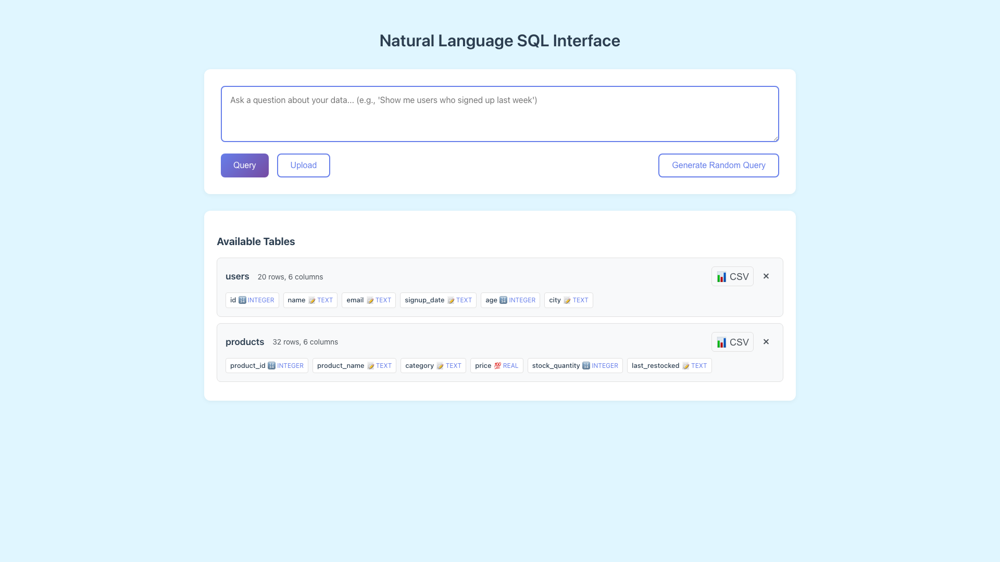
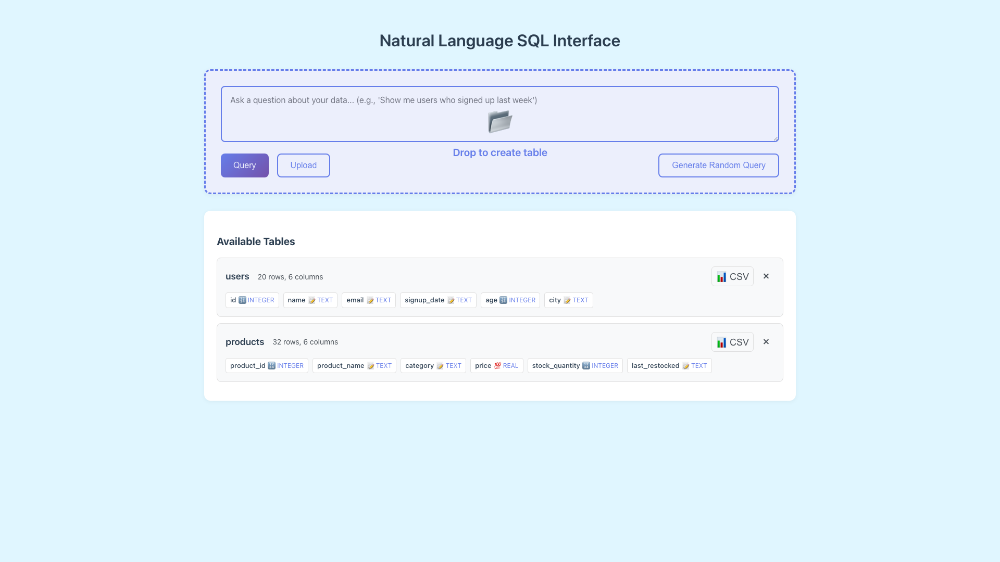
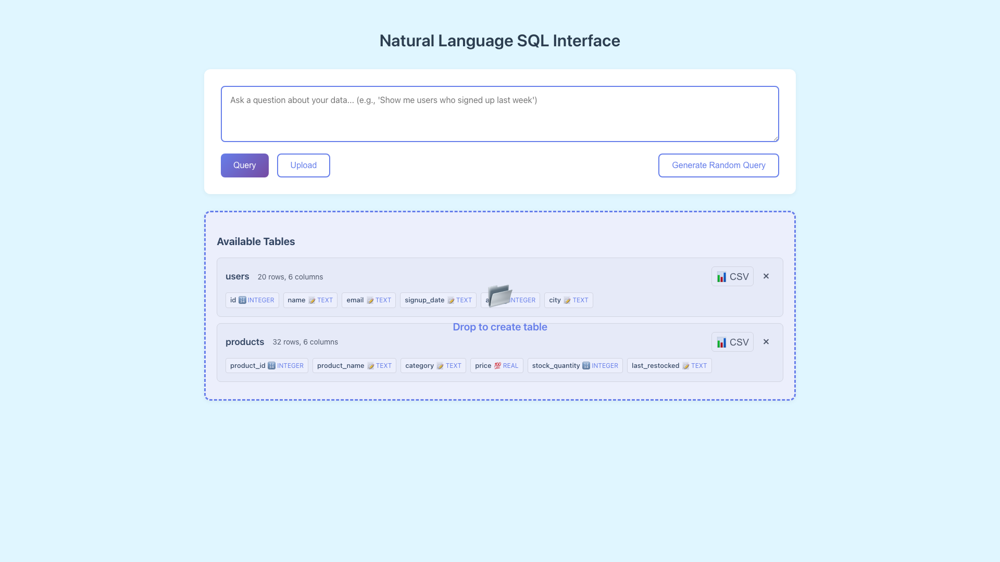

# Expand Drag-Drop Zone to Full Section Surfaces

**ADW ID:** 1
**Date:** 2026-04-29
**Specification:** specs/issue-f482537d-adw-1-sdlc_planner-expand-drag-drop-zone.md

## Overview

This feature expands the file drag-and-drop target area beyond the small modal drop zone to cover the entire query section and available-tables section. When a user drags a CSV, JSON, or JSONL file over either section, a full-section overlay appears with "Drop to create table" text. Releasing the file triggers the existing upload handler without any server-side changes.

## Screenshots

**Initial state — both sections visible before dragging:**



**Overlay active on the query section:**



**Overlay active on the tables section:**



## What Was Built

- Full-section drag-and-drop overlay for `#query-section` (upper div)
- Full-section drag-and-drop overlay for `#tables-section` (lower div)
- Visual overlay with "Drop to create table" text and 📂 icon that appears on file drag-enter
- Drag-counter logic per section to prevent overlay flickering over nested children
- Guard clause to only activate for file drags (not text or other drag types)
- CSS overlay styles with dashed primary-color border and semi-transparent background

## Technical Implementation

### Files Modified

- `app/client/index.html`: Added `.drop-overlay` divs as last children inside `#query-section` and `#tables-section`
- `app/client/src/main.ts`: Added `initializeSectionDragDrop()` function and called it from `DOMContentLoaded`
- `app/client/src/style.css`: Added `position: relative` to `.query-section` and `.tables-section`; added overlay CSS rules

### Key Changes

- **`initializeSectionDragDrop()`** (`main.ts:158–201`): Attaches `dragenter`, `dragleave`, `dragover`, and `drop` listeners to both sections. A per-section `dragCounter` increments on `dragenter` and decrements on `dragleave`; the overlay hides only when the counter returns to zero, preventing flicker as the pointer moves over child elements.
- **File-type guard** (`main.ts`): `e.dataTransfer?.types.includes('Files')` ensures the overlay only activates for file drags, not text or link drags.
- **Drop handler** (`main.ts`): On drop, resets counter, hides overlay, and calls `handleFileUpload(files[0])` — identical to the existing modal drop-zone path.
- **Overlay HTML** (`index.html`): Two `.drop-overlay` divs (IDs `query-section-drop-overlay` and `tables-section-drop-overlay`) are hidden by default (`display: none`) and shown via the `visible` class.
- **CSS overlay** (`style.css`): `position: absolute; inset: 0` stretches the overlay to fill its relatively-positioned parent section. `pointer-events: none` prevents the overlay from intercepting `dragleave` events from children.

## How to Use

1. Open the application in a browser.
2. Locate any CSV, JSON, or JSONL file in your file manager.
3. Drag the file over the **Query** section (upper area) or the **Available Tables** section (lower area).
4. The section highlights with a dashed border and shows "Drop to create table".
5. Release the file — the table is created exactly as if it were dropped into the upload modal.
6. The new table appears in the **Available Tables** list.

> The existing Upload button and modal drag-drop zone remain fully functional.

## Configuration

No configuration required. The feature activates automatically on page load via `initializeSectionDragDrop()` called from the `DOMContentLoaded` handler.

## Testing

Run the E2E test to validate drag-and-drop behavior:

```bash
# From the project root, run the E2E test command
# See .claude/commands/e2e/test_expand_drag_drop_zone.md for details
```

Run server tests to check for regressions:

```bash
cd app/server && uv run pytest
```

Validate TypeScript and build:

```bash
cd app/client && bun tsc --noEmit
cd app/client && bun run build
```

## Notes

- `pointer-events: none` on the overlay is critical — without it, the overlay element itself fires `dragleave` when the pointer enters it, causing the overlay to immediately hide.
- The `dragCounter` per section (not global) ensures that leaving one section does not affect the other section's overlay state.
- Only `files[0]` is passed to `handleFileUpload()`, matching the existing modal drop-zone behavior for multi-file drops.
- The overlay `z-index: 10` keeps it above section content while staying well below the upload modal (`z-index: 1000`).
- No server-side changes were required; the existing `POST /api/upload` endpoint is called unchanged.
